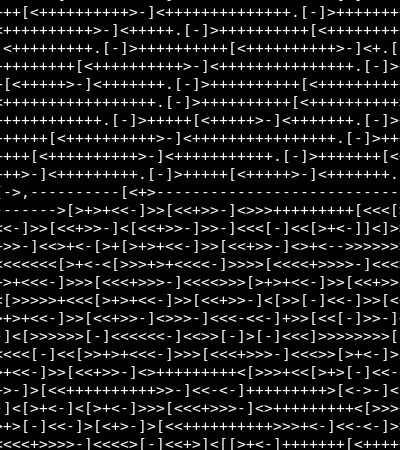
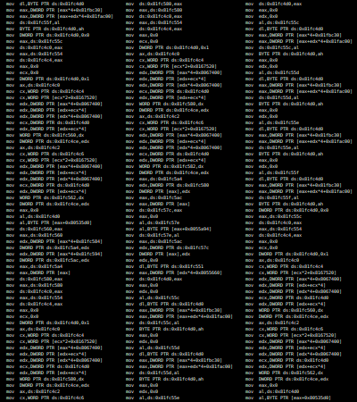

# REMOF

```
      ___           ___           ___           ___           ___     
     /\  \         /\__\         /\  \         /\  \         /\__\    
    /::\  \       /:/ _/_       |::\  \       /::\  \       /:/ _/_   
   /:/\:\__\     /:/ /\__\      |:|:\  \     /:/\:\  \     /:/ /\__\  
  /:/ /:/  /    /:/ /:/ _/_   __|:|\:\  \   /:/  \:\  \   /:/ /:/  /  
 /:/_/:/__/___ /:/_/:/ /\__\ /::::|_\:\__\ /:/__/ \:\__\ /:/_/:/  /   
 \:\/:::::/  / \:\/:/ /:/  / \:\~~\  \/__/ \:\  \ /:/  / \:\/:/  /    
  \::/~~/~~~~   \::/_/:/  /   \:\  \        \:\  /:/  /   \::/__/     
   \:\~~\        \:\/:/  /     \:\  \        \:\/:/  /     \:\  \     
    \:\__\        \::/  /       \:\__\        \::/  /       \:\__\    
     \/__/         \/__/         \/__/         \/__/         \/__/         


github.com/xoreaxeaxeax/movfuscator  :: The single instruction BF compiler   
github.com/zadewg/remof              :: M/o/Vfuscator1 Reverse engineering 

chris domas           @xoreaxeaxeax                                          
mapez                 @zadewg                                              
```
---

Movfuscator compiles code from the esoteric language BrainF@$! to only mov instructions, and is best used in conjunction with the BFBASIC compiler by Jeffry Johnston. Arithmetic, comparisons, jumps, and everything else a program may need are all performed through mov operations; there is no self-modifying code, no transport-triggered calculation, and no other form of non-mov cheating.

> **remof**: A tool for [movfuscated](https://github.com/xoreaxeaxeax/movfuscator) BF programs reverse engineering.

> **movcircus**: The Original movfuscator, implemented in python.

&nbsp;

 BrainFuck                      | GCC                               | M/o/Vfuscator
:------------------------------:|:---------------------------------:|:---------------------------------:
          |   | 

### Usage

`` $ python3.6 movcircus.py [-h] -if INFILE [-mmio] [-nojmp] [-mov] [-cell16] [-O] > out.asm ``
`` $ python3.6 remof.py [-h] -if INFILE ``

movcircus takes the following flags as arguments:
```
--help           show help message and exit
 
--infile         File to read BF from.

--mmio           Use memory mapped I/O. Allows mov instructions instead
                 of int 0x80 for I/O, but requires I/O streams to be
                 backed by files.
  
--nojmp          Replace the single jmp instruction with a faulting mov
                 to implement the program loop.
  
--mov            Use only mov instructions same as -mmio -nojmp.
 
--cell16         Use 16 bit memory cells.
 
--opt            Enable optimization.
```

### TODO:
* Brainfuck++ support
* Code styling, optimization

---
Original M/o/Vfuscator can be found on Cristopher Domas [@xoreaxeaxeax](https://github.com/xoreaxeaxeax) profile.


