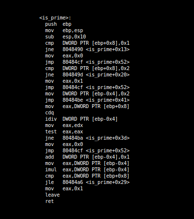

# MOVCIRCUS-REMOF

```
      ___           ___           ___           ___           ___     
     /\  \         /\__\         /\  \         /\  \         /\__\    
    /::\  \       /:/ _/_       |::\  \       /::\  \       /:/ _/_   
   /:/\:\__\     /:/ /\__\      |:|:\  \     /:/\:\  \     /:/ /\__\  
  /:/ /:/  /    /:/ /:/ _/_   __|:|\:\  \   /:/  \:\  \   /:/ /:/  /  
 /:/_/:/__/___ /:/_/:/ /\__\ /::::|_\:\__\ /:/__/ \:\__\ /:/_/:/  /   
 \:\/:::::/  / \:\/:/ /:/  / \:\~~\  \/__/ \:\  \ /:/  / \:\/:/  /    
  \::/~~/~~~~   \::/_/:/  /   \:\  \        \:\  /:/  /   \::/__/     
   \:\~~\        \:\/:/  /     \:\  \        \:\/:/  /     \:\  \     
    \:\__\        \::/  /       \:\__\        \::/  /       \:\__\    
     \/__/         \/__/         \/__/         \/__/         \/__/         


github.com/xoreaxeaxeax/movfuscator  :: The single instruction BF compiler   
github.com/zadewg/remof              :: M/o/Vfuscator1 Reverse engineering 

chris domas           @xoreaxeaxeax                                          
mapez                 @zadewg                                              
```
---

## Overview 
Movfuscator compiles code from the esoteric language BrainF@$! to only mov instructions. Arithmetic, comparisons, jumps, and everything else a program may need are all performed through mov operations; there is no self-modifying code, no transport-triggered calculation, and no other form of non-mov cheating.


&nbsp;
<!---
 BrainFuck                      | GCC                               | M/o/Vfuscator
:------------------------------:|:---------------------------------:|:---------------------------------:
          |   | 
-->

The following tools can be found under this repository:

> **remof**: A tool for [movfuscated](https://github.com/xoreaxeaxeax/movfuscator) BF programs reverse engineering.

> **movcircus**: The Original movfuscator, implemented in python.

*REMOF will reverse the steps performed by the obfuscator when compiling the program, effectively extracting plain BF code. External tools for instruction shuffling can be used in conjunction with movcircus and movfuscator to harden it against this kind of pattern-matching attacks.*

## Obfuscating other languages

Languages other than BF can be compiled using MOVCIRCUS  by first converting those languages to BF. Current BF compilable languages are:

* BASIC, using Jeffry Johnston's [BFBASIC](https://esolangs.org/wiki/BFBASIC) compiler.
* C using the [LIBBF](http://savannah.nongnu.org/projects/libbf) project.
* FBF using Tritonio's [FBF](http://www.inshame.com/search/label/My%20Progs%3A%20FuckBrainfuck)


*Yes sir, you can obfuscate C and BASIC with this bad boy.*

## Usage

`` $ python3.6 movcircus.py [-h] -if INFILE [-mmio] [-nojmp] [-mov] [-cell16] [-O] > out.asm ``

`` $ python3.6 remof.py [-h] -if INFILE -of OUTFILE ``  

&nbsp;

***movcircus takes the following flags as arguments:***
```
--infile         File to read BF from.

--mmio           Use memory mapped I/O. Allows mov instructions instead
                 of int 0x80 for I/O, but requires I/O streams to be
                 backed by files.
  
--nojmp          Replace the single jmp instruction with a faulting mov
                 to implement the program loop.
  
--mov            Use only mov instructions same as -mmio -nojmp.
 
--cell16         Use 16 bit memory cells.
 
--opt            Enable optimization.
```

---

## Output

**MOVCIRCUS**
```
 /$$      /$$  /$$$$$$  /$$    /$$  /$$$$$$  /$$$$$$ /$$$$$$$   /$$$$$$  /$$   /$$  /$$$$$$     
| $$$    /$$$ /$$__  $$| $$   | $$ /$$__  $$|_  $$_/| $$__  $$ /$$__  $$| $$  | $$ /$$__  $$    
| $$$$  /$$$$| $$  \ $$| $$   | $$| $$  \__/  | $$  | $$  \ $$| $$  \__/| $$  | $$| $$  \__/    
| $$ $$/$$ $$| $$  | $$|  $$ / $$/| $$        | $$  | $$$$$$$/| $$      | $$  | $$|  $$$$$$     
| $$  $$$| $$| $$  | $$ \  $$ $$/ | $$        | $$  | $$__  $$| $$      | $$  | $$ \____  $$    
| $$\  $ | $$| $$  | $$  \  $$$/  | $$    $$  | $$  | $$  \ $$| $$    $$| $$  | $$ /$$  \ $$    
| $$ \/  | $$|  $$$$$$/   \  $/   |  $$$$$$/ /$$$$$$| $$  | $$|  $$$$$$/|  $$$$$$/|  $$$$$$/    
|__/     |__/ \______/     \_/     \______/ |______/|__/  |__/ \______/  \______/  \______/     


github.com/xoreaxeaxeax/movfuscator  :: The single instruction BF compiler   
github.com/zadewg/remof              :: M/o/Vfuscator Python implementation    

chris domas           @xoreaxeaxeax                                              
mapez                 @zadewg                                                   


0x001a9c35	6d 6f 76 20 65 61 78 2c 20 5b 6f 6e 5d                      	mov eax, [on]
0x001a9c36	6d 6f 76 20 65 62 78 2c 20 5b 73 5f 6d 73 2b 65 61 78 5d    	mov ebx, [s_ms+eax]
0x001a9c37	6d 6f 76 20 65 64 78 2c 20 5b 64 70 5d                      	mov edx, [dp]
0x001a9c38	6d 6f 76 20 65 61 78 2c 20 30                               	mov eax, 0
0x001a9c39	6d 6f 76 20 61 6c 2c 20 5b 65 62 78 2b 65 64 78 5d          	mov al, [ebx+edx]
0x001a9c3a	6d 6f 76 20 61 6c 2c 20 5b 69 6e 63 62 2b 65 61 78 5d       	mov al, [incb+eax]
0x001a9c3b	6d 6f 76 20 5b 65 62 78 2b 65 64 78 5d 2c 20 61 6c          	mov [ebx+edx], al
0x001a9c3c	                                                            	
0x001a9c3d	6d 6f 76 20 65 61 78 2c 20 5b 6f 6e 5d                      	mov eax, [on]
0x001a9c3e	6d 6f 76 20 65 61 78 2c 20 5b 68 2b 65 61 78 5d             	mov eax, [h+eax]
0x001a9c3f	6d 6f 76 20 65 61 78 2c 20 5b 65 61 78 5d                   	mov eax, [eax]
0x001a9c40	                                                            	
0x001a9c41	6d 6f 76 20 65 61 78 2c 20 5b 6f 6e 5d                      	mov eax, [on]
0x001a9c42	6d 6f 76 20 65 61 78 2c 20 5b 73 5f 6d 7a 2b 65 61 78 5d    	mov eax, [s_mz+eax]
0x001a9c43	                                                            	
0x001a9c44	6d 6f 76 20 65 64 78 2c 20 5b 64 70 5d                      	mov edx, [dp]
0x001a9c45	6d 6f 76 20 61 6c 2c 20 5b 65 61 78 2b 65 64 78 5d          	mov al, [eax+edx]
0x001a9c46	6d 6f 76 20 5b 63 5d 2c 20 61 6c                            	mov [c], al
0x001a9c47	                                                            	
0x001a9c48	6d 6f 76 20 65 61 78 2c 20 34                               	mov eax, 4
0x001a9c49	6d 6f 76 20 65 62 78 2c 20 31                               	mov ebx, 1
0x001a9c4a	6d 6f 76 20 65 63 78 2c 20 63                               	mov ecx, c
0x001a9c4b	6d 6f 76 20 65 64 78 2c 20 31                               	mov edx, 1
0x001a9c4c	69 6e 74 20 30 78 38 30                                     	int 0x80
```

&nbsp;

**REMOF**


---
Original M/o/Vfuscator can be found on Cristopher Domas [@xoreaxeaxeax](https://github.com/xoreaxeaxeax) profile.


